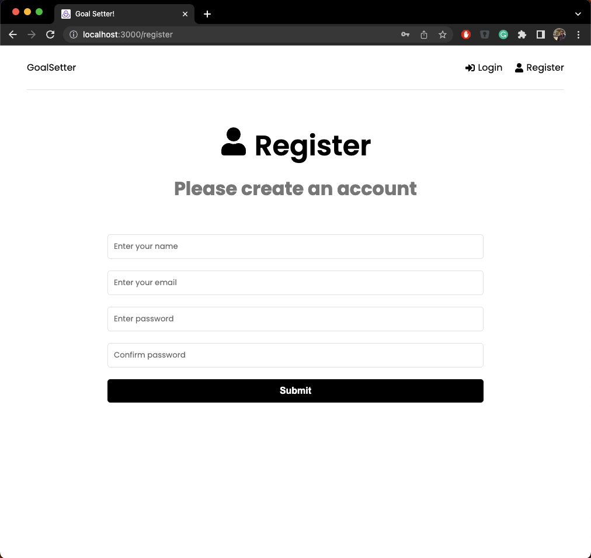
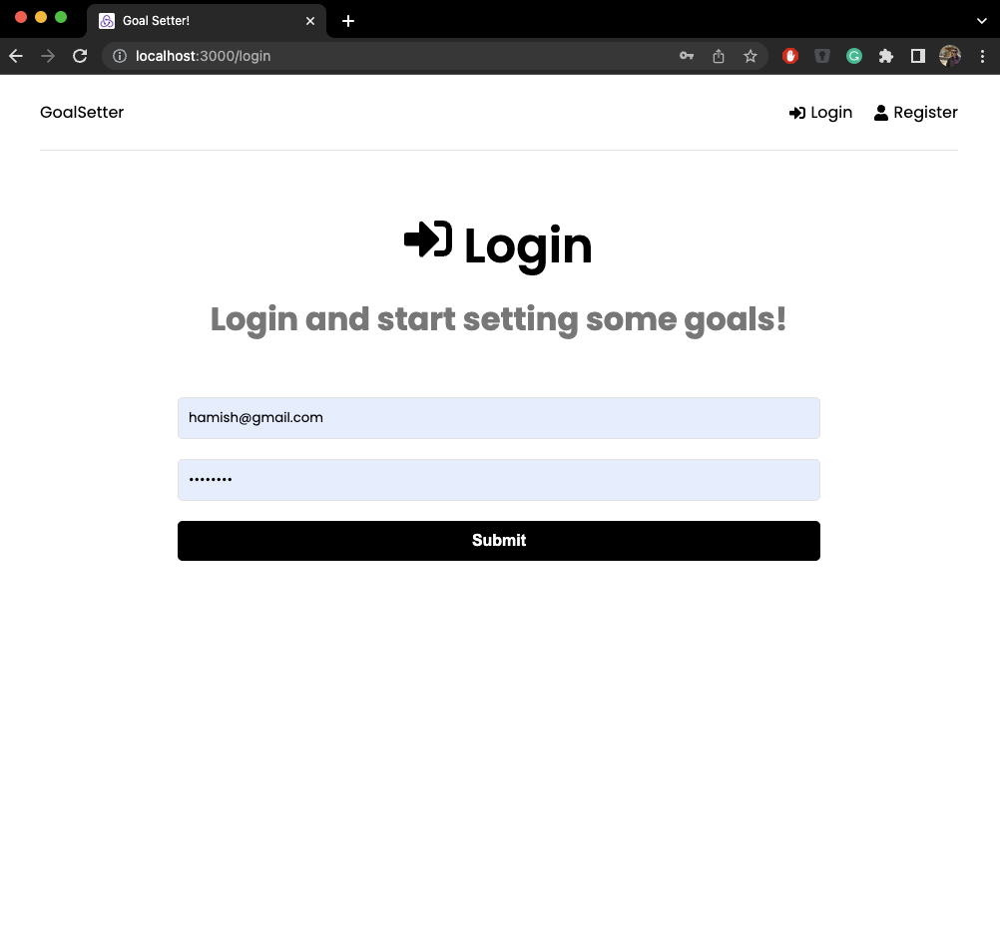
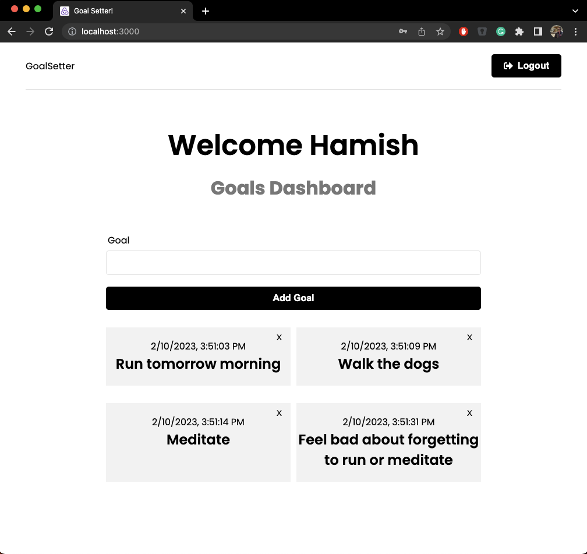

# Goal Setter App! 

This application is a goal setting application using the MERN stack and utilizing Redux for central state management.

## Register
User will have to create an account in order to start creating goals.

## Login
If the user has already created and account they can simply login. The site uses JWTs to track whether a user is logged in or not.

## Dashboard
The use can create and delete their own goals. The site uses their user id from their JWT in order to filter out which goals get displayed, so they can only see and delete their own goals

